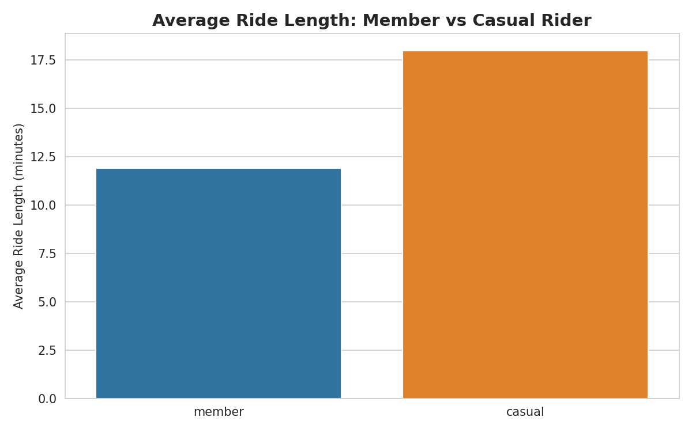
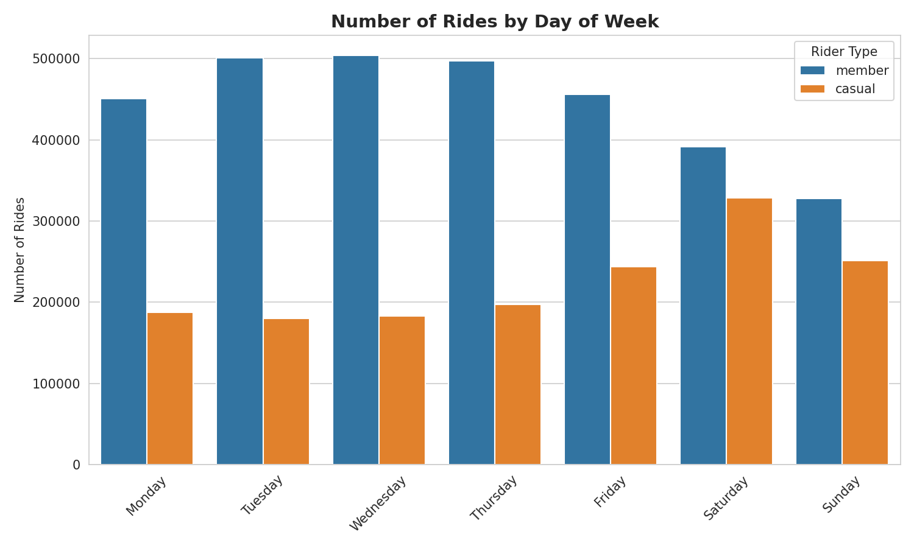
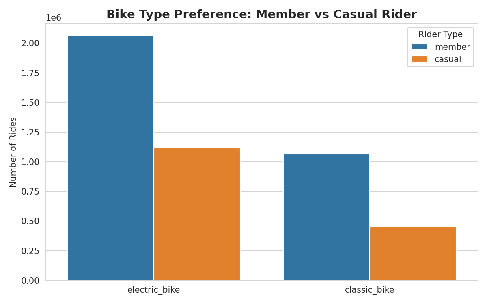
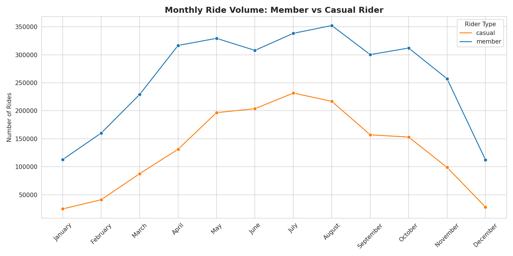

# cyclistic-bikeshare-analysis
Bike-share usage analysis comparing annual members vs casual riders — Google Data Analytics Certificate Case Study
## Business Task

Analyze 12 months of Cyclistic trip data (September 2025 – August 2026) to identify how annual members and casual riders use Cyclistic bikes differently. These insights will support the marketing team in designing a strategy to convert casual riders into annual members.

## Data Sources

- Public Divvy trip data, covering September 2025 to August 2026 (12 monthly files)
- Raw dataset: 4,702,361 rows, 13 columns
- Data provided by Motivate International Inc. under license (no personally identifiable information; individual riders cannot be tracked across purchases)

## Data Cleaning

- **Datetime conversion**: Converted `started_at` / `ended_at` to datetime format; derived `ride_length` (minutes) and `day_of_week` / `day_name`
- **Outlier removal**: Removed 29 rides with negative duration and 3,146 rides exceeding 24 hours (0.07% of total data), likely due to system testing or bikes not properly docked
- **Missing value validation**: Missing station names (~19% of records) were confirmed to correspond 100% to `electric_bike` rides — a structural difference in the data (electric bikes can be parked outside docking stations), not a data quality issue. No further cleaning required.

## Key Findings

### 1. Ride Length

Casual riders take significantly longer rides on average — 18 minutes vs. 12 minutes for members (a 51% difference).

### 2. Weekly Usage Pattern

Members' usage is concentrated on weekdays, consistent with commuting behavior. Casual riders peak on weekends, consistent with leisure/recreational use.

### 3. Bike Type Preference

Casual riders show a stronger preference for electric bikes (71.2%) compared to members (66.0%).

### 4. Monthly Trend

## Recommendations

*(To be finalized after completing seasonal trend analysis)*

## Tools Used

Python (pandas, matplotlib, seaborn) in Jupyter Notebook
